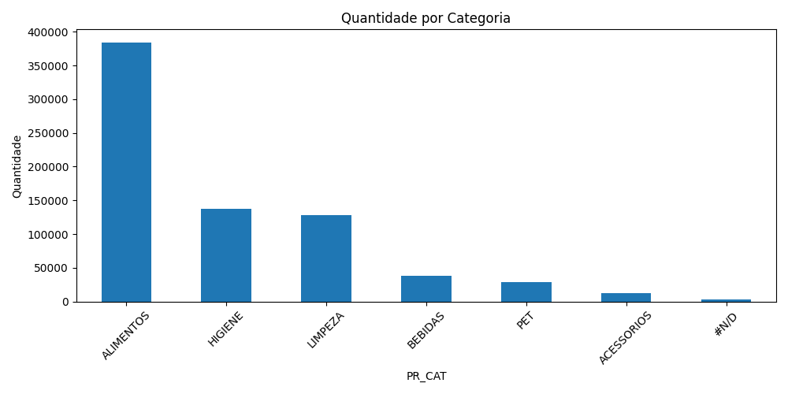
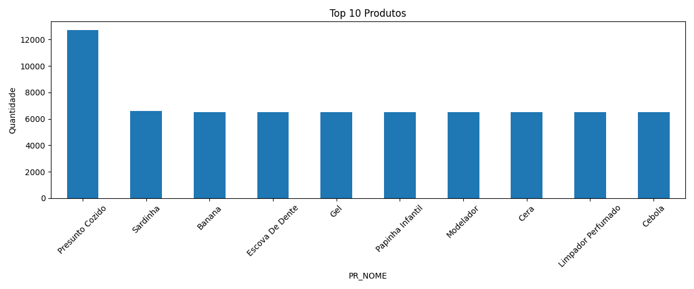

# 📊 Mini-Projeto Avaliativo: Análise Exploratória de Dados (Varejo)

## Módulo 1 - Semana 07 — Análise de Dados com Python

**Aluna:** Caroline de Souza Cunha Lopes  
**Turma:** T1  

---

# 📌 1. Instruções de Execução

O projeto foi desenvolvido e testado localmente utilizando o **VS Code** e a linguagem **Python**.

Para executar a análise:

## Requisitos

- Python 3.x instalado
- Bibliotecas:
  - pandas
  - numpy
  - matplotlib

## Instalação das bibliotecas

```bash
pip install pandas numpy matplotlib
```

## Execução do projeto

O arquivo bruto `Base_Varejo.csv` deve estar localizado na raiz da pasta do projeto.

Execute o comando abaixo no terminal:

```bash
python main.py
```

Após a execução, o script irá:

- realizar a limpeza dos dados
- gerar estatísticas descritivas
- produzir agrupamentos analíticos
- criar gráficos exploratórios
- exportar o arquivo tratado `df_limpo.csv`

---

# 📚 2. Reflexão Teórica: O Papel do ETL e da Qualidade de Dados

O processo ETL (Extract, Transform, Load) representa uma etapa fundamental da Engenharia e da Análise de Dados moderna. Em ambientes corporativos, os dados extraídos de sistemas transacionais frequentemente apresentam inconsistências, registros duplicados, valores ausentes e problemas de padronização.

Neste projeto, a etapa de transformação foi essencial para garantir a qualidade analítica da base de varejo utilizada.

As principais práticas aplicadas foram:

- leitura estruturada da base utilizando pandas
- identificação e tratamento de valores nulos
- remoção de registros duplicados
- padronização de colunas textuais
- conversão de datas para o formato datetime
- aplicação de estatística descritiva
- geração de agrupamentos analíticos

Na coluna `CL_FHL` (Número de Filhos), foi utilizada a mediana para imputação dos valores nulos. Essa estratégia reduz o impacto de possíveis valores extremos (outliers) e preserva melhor a distribuição original dos dados.

Garantir a integridade dos dados nesta etapa evita o fenômeno conhecido como **Garbage In, Garbage Out**, onde dados inconsistentes geram análises incorretas e decisões equivocadas.

---

# 📈 3. Relatório de Conclusões e Insights Operacionais

A análise exploratória permitiu identificar padrões relevantes na base de varejo.

## Principais Insights

### Insight 1 — Categoria com Maior Volume

A categoria **ALIMENTOS** apresentou o maior volume de movimentações da base, totalizando 9.672 registros. Isso demonstra forte representatividade dessa categoria nas operações do varejo analisado.

---

### Insight 2 — Categorias com Menor Participação

A categoria **ACESSORIOS** apresentou baixa participação em comparação às demais categorias, indicando potencial para estratégias de marketing e cross-selling.

---

### Insight 3 — Distribuição de Compras por Gênero

A análise agrupada por `CL_GENERO` demonstrou diferença no volume de compras entre os gêneros, fornecendo informações relevantes para segmentação comercial e ações de relacionamento com clientes.

---

### Insight 4 — Qualidade dos Dados

Foram identificados registros com valores ausentes e inconsistências cadastrais, especialmente em categorias de produtos. Esses problemas exigiram tratamento de dados antes da realização das análises.

---

### Insight 5 — Importância da Limpeza de Dados

A remoção de duplicidades e a padronização das informações foram fundamentais para aumentar a confiabilidade estatística da análise exploratória.

---

# 🛠️ Tecnologias Utilizadas

- Python
- Pandas
- NumPy
- Matplotlib
- VS Code
- Git e GitHub

---

# 📂 Estrutura do Projeto

```text
Miniprojeto_CarolineSCLopes_Analise_de_Dados_T1/
│
├── Base_Varejo.csv
├── df_limpo.csv
├── main.py
├── README.md
└── imagens/
    ├── grafico_categoria.png
    └── grafico_produtos.png
```

---

# 📊 Visualizações

## Quantidade por Categoria



---

## Top 10 Produtos



---

# 🚀 Considerações Finais

O desenvolvimento deste mini-projeto permitiu aplicar conceitos fundamentais de:

- ETL
- limpeza e transformação de dados
- análise exploratória
- estatística descritiva
- agrupamentos analíticos
- versionamento com Git e GitHub

Além do aprendizado técnico, o projeto reforçou a importância da qualidade dos dados para apoiar análises confiáveis e tomadas de decisão mais assertivas.